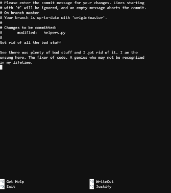

# GitHub Teamwork Toolkit

This repo will provide programmers with some basic knowledge necessary when making contributions to projects. It is meant to referenced in tandem with the live presentation of "GitHub Teamwork Toolkit".

### Contents
1. [Fork and Pull Workflow](#fork-and-pull-workflow)
	* [Summary/Quick Reference](#fork-and-pull-summary)
2. [Commit messages](#commit-messages)

### Fork and Pull Workflow
The fork and pull work flow is a popular method for contributing to repositories on GitHub. When using this flow, each user will fork their own copy of a repo that they want to contribute. The user then clones the forked repo onto their local machine and then can begin hacking away and building features. There are a few more steps in between that we will discuss below.

#### Setup - these steps should only be done once

**Step 1 - Fork the repo:** Navigate to the repository that you want to contribute to and fork it. When you fork a repository, an exact copy of that repo is copied to your account. You can make changes to a fork and it wont affect the original repo, but since we want to make changes to the original, we have to follow some more steps.

**Step 2 - Clone your fork:** Now that you have a forked copy of the main repo, use git clone on your fork to create a local copy on your machine. This way you can make actual changes to the code and test out new features. To clone a repo use the command:
`$ git clone https://github.com/link/to/your/forked/repo`

**_Note: The '$' is a usual part of the terminal. It just lets you know where you can start typing commands. Do not type this when writing commands. If you do not see a '$' when using your terminal, don't worry. It is only used in certain types of terminals._**

**Step 3 - Set upstream repo:** Currently there is no way for you to receive updates from the main repo. Your forked repo on GitHub and your local repo on your machine are not linked to the main repo at all. In order to change this you will set the main repo as your upstream repository to your local branch. Now when you update your local branch, it will pull updates from the main repo. In order to do this use the command, open your terminal and navigate to your local repo. Then input `$ git remote add upstream https:github.com/link/to/MAIN/repo`, where the link to the main repo is the URL for main repository

#### Syncing - do this every time before coding/pushing

**Step 1 - Fetch updates from main repo:** You want to make sure your local repo is up-to-date before you start making changes. In order to do this, you will fetch the branches from the remote repo. Open your terminal and navigate to  your local repo. Enter the command `$ git fetch upstream`

**Step 2 - Merge changes from upstream:** Now that you have fetched the changes from upstream. It is time to merge them using two commands. First we want to make sure that we are the on the master branch by using `$ git checkout master`. Then we want to merge the changes from upstream by using `$ git merge master/upstream`

**Step 3 - Push changes to your fork:** In step two you updated your local repo, but now you need to update your forked repo on GitHub as well. In order to do this, just push the changes to your fork using the command `$ git push origin master`
Now your local fork and your repo are updated.

#### Making Local Changes
Now that we have everything updated, we want to make some changes and push some code.

**Step 1 - Create a feature branch:** Every time you make a new feature/change, you want to make those changes in a completely new branch. In order to do this we will use two commands. First `$ git checkout master` to make sure we are on master. Then `$ git checkout -b FEATURE_BRANCH` where 'FEATURE_BRANCH' is where you'll give a name to your new feature. Make all of your changes in your new feature branch

**Step 2 - Make and commit your changes:** After you are done making changes make sure to commit them using the `$ git add` and `$ git commit`

**Step 3 - Push your new feature branch to your fork:** Do this by using the command `$ git push -u origin FEATURE_BRANCH` , where 'FEATURE_BRANCH' is the name you gave your branch in step 1.

#### Make a Pull Request
If you haven't made a pull request. Today is a big day for you bud. After pushing your branch to GitHub, go to your forked repo on GitHub.com. You should see something like the picture below. Click on the green 'Compare & Pull Request' button. After this give your pull request a title and a description and click the green 'Create pull request' button. Now you've made a pull request and you're just waiting for your pull request to be approved. Woohoo!
 

#### After Pull Request is Approved
If you pull request is approved, you want to delete your feature branch. The changes and commits you made are now a part of the main repo, congrats!  
**Step 1 - Delete the remote feature branch:** 
* Option 1: Go to pull request page and click the 'Delete branch' button (see photo below)

* Option 2: Open your terminal in your local repo and use the command `$git push origin --delete <feature_branch>` , where feature branch is the name of the branch that was accepted in the pull request  

**Step 2 - Delete local feature branch:**
To delete the local feature branch, make sure that you are on master first by using `$ git checkout master`. Then delete the feature branch by using `$ git branch -d FEATURE_BRANCH`. You can also use `$ git branch -D FEATURE_BRANCH`, but using the capital 'D' will force delete the branch, even if there is an issue. So BE CAREFUL.

#### Protip for users maintaing a MAIN repo
If you are maintaining a repo that people are contributing to, your going to want to test pull requests before you accept them. You can use the command `$ git fetch origin pull/ID/head:BRANCHNAME`. In this command the ID, is the ID of the pull request that you want to play with. The 'BRANCHNAME' will create branch of that name in your local repo.

:fire: :fire: :fire: :fire: :fire: :fire: :fire: :fire: :fire: :fire: :fire: :fire: :fire: :fire: :fire:
### Fork and Pull Summary
#### Set up - only done once:
1. Fork the main repo
2. Clone your fork: `$ git clone` to clone your fork
3. Link you local to main repo: `$ git remote add upstream https:github.com/link/to/MAIN/repo`
#### Sync your fork - do before making changes:
1. Get updates: `$ git fetch upstream`
2. Checkout master: `$ git checkout master`
3. Merge changes: `git merge master/upstream`
4. Push changes to fork: `git push origin master`
#### Making Local Changes
1. Make sure you are on master: `$ git checkout master`
2. Create feature branch: `$ git checkout -b FEATURE_BRANCH`
3. Save local changes using `$ git add` and `$ git commit`
4. Push local changes to fork: `git push -u origin FEATURE_BRANCH`
#### Pull requests
* After pushing a feature branch, make a pull request by navigating to your fork and clicking the 'Compare & pull request button'. See photo [here](#make-a-pull-request).
#### Deleting Branches after approval
**Step 1:** Delete the remote feature branch
* Option 1: Click on 'Delete branch' button on pull request page. See [here](#after-pull-request-is-approved).
* Option 2: Open terminal in local repo. Check out master using `$ git checkout master`. Enter the command `$git push origin --delete <feature_branch>`  

**Step 2:** Delete the local branch
* Make sure you are on master by entering `$ git checkout master`. Then delete the branch by entering `$ git branch -d FEATURE_BRANCH`. You can also **force delete** a branch by using `$ git branch -D FEATURE_BRANCH` , but this is may have **_unintended consequences_**.

#### Checkout Pull Request before approval
* If you want to play with a PR before approving it, you can use the command `$ git fetch origin pull/ID/head:BRANCHNAME`

### Commit messages
Good commit messages are essential when contributing to a project. Most programmers are familiar with the command `$ git commit -m 'One line commit message'`, but if your commit needs a more complex commit message, then use the `$ git commit` command instead. This will take you to an editor which will make it easier to write well structured commit messages.

As you see above there are many lines that start with '#'. These are just comments and you can ignore them. You can start writing on any line after the '#'. The first line should be less than 50 characters and should be descriptive. Leave a one line gap and then start writing a descriptive commit message afterwards. See the photo above.

[This website](https://chris.beams.io/posts/git-commit/) provides a good set of rules to follow for commit messages.

When you are done writing your message, hit `CTRL+O` to 'write out' your message. You should see the options at the bottom of your screen change. There should also be something that says 'File Name to Write: path/to/blah/blah'. Hit enter to save your commit message. Your commit is now saved and you can hit `CTRL + X` to exit the text editor.

MUCH WOW! :see_no_evil: GREAT COMMIT MESSAGE! :muscle: GOOGLE HERE I COME! :neckbeard:

